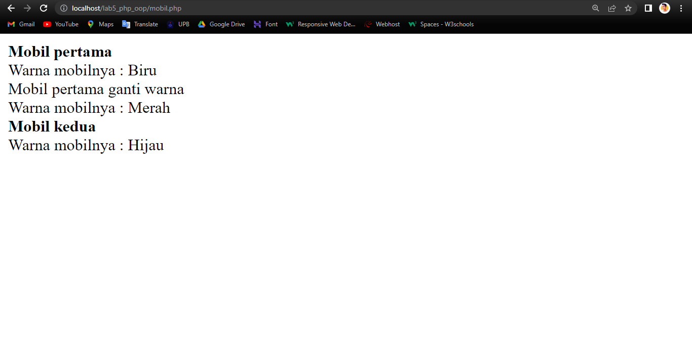
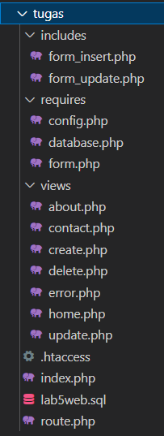
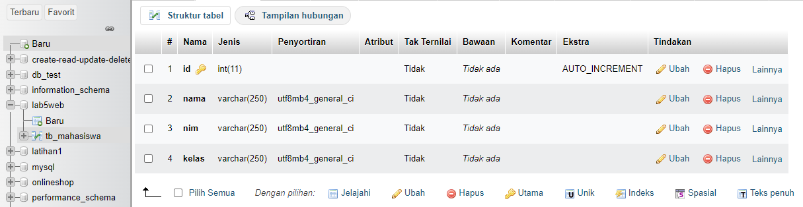
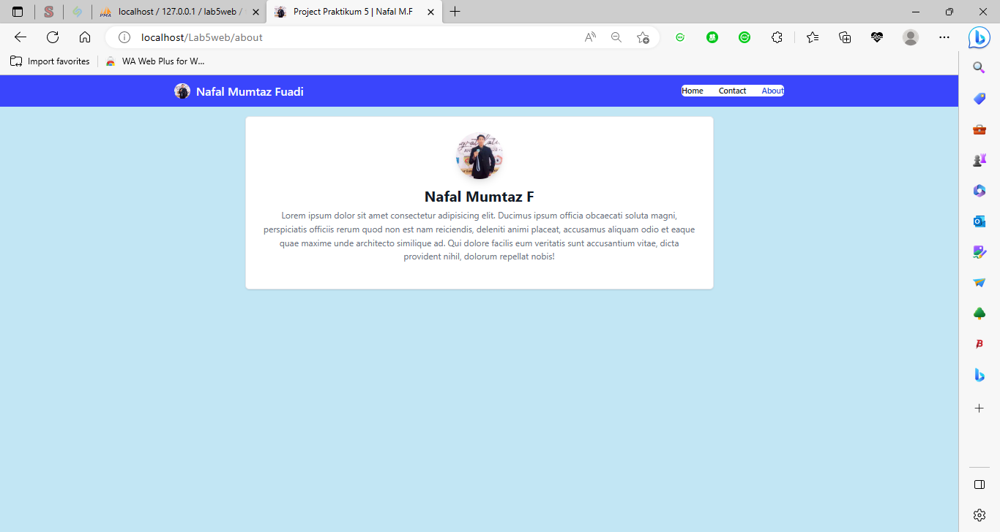
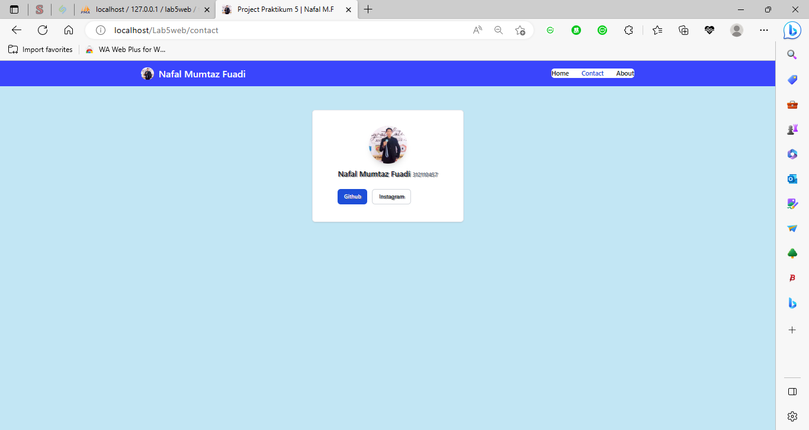
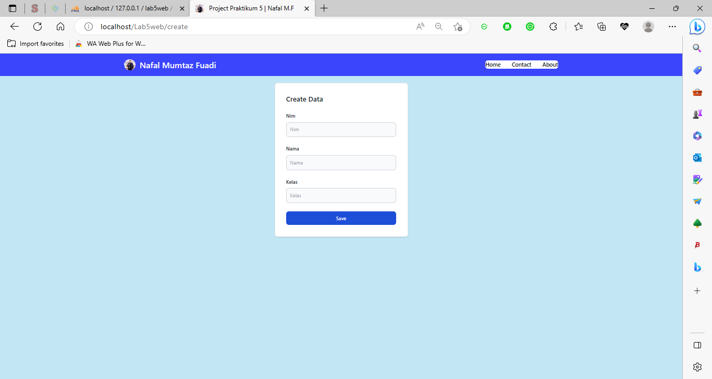
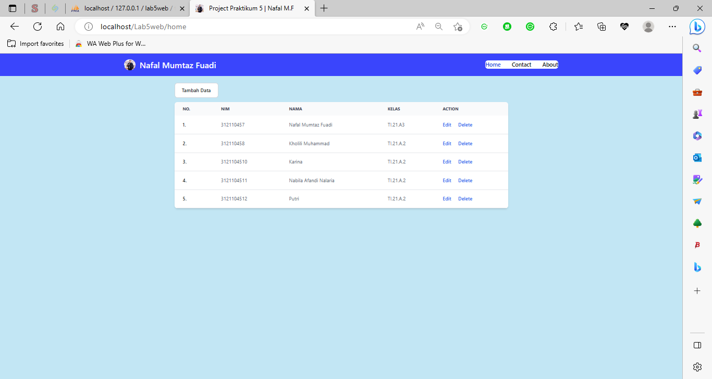

# PROJECT PRAKTIKUM 5 (PHP OOP)

**_Nama: Nafal Mumtaz Fuadi_** <br/>
**_Nim : 312110457_** <br/>
**_Kelas : TI.21.A2_** <br/>

**Teknik Informatika - UNIVERSITAS PELITA BANGSA**

-----------------------------------------------------------------------
# <p align="center">Praktikum 5: PHP OOP</p>

### Tujuan
* Mampu memahami konsep dasar OOP.
* Mampu memahami konsep dasar _Class_ dan _Object_.
* Mampu membuat program OOP sederhana menggunakan PHP.

### Instruksi Praktikum
* Persiapkan text editor misalnya VSCode.
* Buat folder baru dengan nama lab5_php_database pada docroot webserver (htdocs)
* Ikuti langkah-langkah praktikum yang akan dijelaskan berikutnya.


---
# <p align="center">Langkah-langkah Praktikum</p>
### Buat file baru dengan nama _`mobil.php`_
```
<?php
/**
 * Program sederhana pendefinisian class dan pemanggilan class.
 **/
class Mobil
{
    private $warna;
    private $merk;
    private $harga;
    public function __construct()
    {
        $this->warna = "Biru";
        $this->merk = "BMW";
        $this->harga = "10000000";
    }
    public function gantiWarna($warnaBaru)
    {
        $this->warna = $warnaBaru;
    }
    public function tampilWarna()
    {
        echo "Warna mobilnya : " . $this->warna;
    }
}
// membuat objek mobil
$a = new Mobil();
$b = new Mobil();
// memanggil objek
echo "<b>Mobil pertama</b><br>";
$a->tampilWarna();
echo "<br>Mobil pertama ganti warna<br>";
$a->gantiWarna("Merah");
$a->tampilWarna();
// memanggil objek
echo "<br><b>Mobil kedua</b><br>";
$b->gantiWarna("Hijau");
$b->tampilWarna();
?>
```



## Class Library
Class library merupakan pustaka kode program yang dapat digunakan bersama pada beberapa file
yang berbeda (konsep modularisasi). Class library menyimpan fungsi-fungsi atau class object
komponen untuk memudahkan dalam proses development aplikasi.

Contoh class library untuk membuat form.

### Buat file baru dengan nama _`form.php`_
```
<?php
/**
* Nama Class: Form
* Deskripsi: CLass untuk membuat form inputan text sederhan
**/
class Form
{
private $fields = array();
private $action;
private $submit = "Submit Form";
private $jumField = 0;
public function __construct($action, $submit)
{
$this->action = $action;
$this->submit = $submit;
}
public function displayForm()
{
echo "<form action='".$this->action."' method='POST'>";
echo '<table width="100%" border="0">';
for ($j=0; $j<count($this->fields); $j++) {
echo "<tr><td

align='right'>".$this->fields[$j]['label']."</td>";

echo "<td><input type='text'

name='".$this->fields[$j]['name']."'></td></tr>";
}
echo "<tr><td colspan='2'>";
echo "<input type='submit' value='".$this->submit."'></td></tr>";
echo "</table>";
}
public function addField($name, $label)
{
$this->fields [$this->jumField]['name'] = $name;
$this->fields [$this->jumField]['label'] = $label;
$this->jumField ++;
}
}
?>
```

File tersebut tidak dapat dieksekusi langsung, karena hanya berisi deklarasi class. Untuk
menggunakannya perlu dilakukan include pada file lain yang akan menjalankan dan harus dibuat
instance object terlebih dulu.

Contoh implementasi pemanggilan class library form.php

### Buat file baru dengan nama _`form_input.php`_
```
<?php
/**
* Program memanfaatkan Program 10.2 untuk membuat form inputan sederhana.
**/
include "form.php";
echo "<html><head><title>Mahasiswa</title></head><body>";
$form = new Form("","Input Form");
$form->addField("txtnim", "Nim");
$form->addField("txtnama", "Nama");
$form->addField("txtalamat", "Alamat");
echo "<h3>Silahkan isi form berikut ini :</h3>";
$form->displayForm();
echo "</body></html>";
?>
```

### Contoh lainnya untuk database connection dan query. Buat file dengan nama _`database.php`_
```
<?php
class Database
{
    protected $host;
    protected $user;
    protected $password;
    protected $db_name;
    protected $conn;
    public function __construct()
    {
        $this->getConfig();
        $this->conn = new mysqli(
            $this->host, $this->user, $this->password,
            $this->db_name
        );
        if ($this->conn->connect_error) {
            die("Connection failed: " . $this->conn->connect_error);
        }
    }
    private function getConfig()
    {
        include_once("config.php");
        $this->host = $config['host'];
        $this->user = $config['username'];
        $this->password = $config['password'];
        $this->db_name = $config['db_name'];
    }
    public function query($sql)
    {
        return $this->conn->query($sql);
    }
    public function get($table, $where = null)
    {
        if ($where) {
            $where = " WHERE " . $where;
        }
        $sql = "SELECT * FROM " . $table . $where;
        $sql = $this->conn->query($sql);
        $sql = $sql->fetch_assoc();
        return $sql;
    }
    public function insert($table, $data)
    {
        if (is_array($data)) {
            foreach ($data as $key => $val) {
                $column[] = $key;
                $value[] = "'{$val}'";
            }
            $columns = implode(",", $column);
            $values = implode(",", $value);
        }
        $sql = "INSERT INTO " . $table . " (" . $columns . ") VALUES (" . $values . ")";
        $sql = $this->conn->query($sql);
        if ($sql == true) {
            return $sql;
        } else {
            return false;
        }
    }
    public function update($table, $data, $where)
    {
        $update_value = "";
        if (is_array($data)) {
            foreach ($data as $key => $val) {
                $update_value[] = "$key='{$val}'";
            }
            $update_value = implode(",", $update_value);
        }
        $sql = "UPDATE " . $table . " SET " . $update_value . " WHERE " . $where;
        $sql = $this->conn->query($sql);
        if ($sql == true) {
            return true;
        } else {
            return false;
        }
    }
    public function delete($table, $filter)
    {
        $sql = "DELETE FROM " . $table . " " . $filter;
        $sql = $this->conn->query($sql);
        if ($sql == true) {
            return true;
        } else {
            return false;
        }
    }
}
?>
```


---
# <p align="center">Tugas</p>
Implementasikan konsep modularisasi pada kode program pada praktukum sebelumnya dengan
menggunakan class library untuk _`form`_ dan _`database connection`_.

### Directory Tree



### Buat DataBase



### Buat file baru dengan nama _`.htaccess`_
```
RewriteEngine On
RewriteCond %{REQUEST_FILENAME} !-f
RewriteCond %{REQUEST_FILENAME} !-d
RewriteRule ^(.*)$ index.php?url=$1 [L,QSA]
```

### Buat file baru dengan nama _`index.php`_
```
<?php
require_once "route.php";
require_once "./requires/database.php";
$moduleName =
  strpos(@$_REQUEST["url"], "/") ? str_split(@$_REQUEST["url"], strpos(@$_REQUEST["url"], "/"))[0] : @$_REQUEST['url'];

$url = [
  "home" => "./views/home.php",
  "create" => "./views/create.php",
  "update" => "./views/update.php",
  "delete" => "./views/delete.php",
  "contact" => "./views/contact.php",
  "about" => "./views/about.php"
];

$routes = new Route($url);
?>


<!DOCTYPE html>
<html lang="en">

<head>
  <meta charset="UTF-8">
  <meta http-equiv="X-UA-Compatible" content="IE=edge">
  <meta name="viewport" content="width=device-width, initial-scale=1.0">
  <meta name="author" content="Nafal mf">
  <link rel="icon" href="https://avatars.githubusercontent.com/u/92731254?v=4" />

  <!-- css -->
  <script src="https://cdn.tailwindcss.com"></script>
  <title>Project Praktikum 5 | Nafal M.F</title>
</head>

<body class="dark:bg-slate-900 dark:text-white" style="background-color:rgb(135, 206, 235,0.5);">
  <nav class="bg-white border-gray-200 dark:bg-gray-900" style="background-color:RGBA( 0, 0, 255, 0.7 ); color:white;">
    <div class="max-w-screen-xl flex flex-wrap items-center justify-between mx-auto p-4">
      <a href="<?= $moduleName == 'update' ? '../home' : ' home' ?>" class="flex items-center cursor-pointer">
        
        <span class="self-center text-2xl font-semibold whitespace-nowrap dark:text-white">Nafal Mumtaz Fuadi</span>
      </a>
      <button data-collapse-toggle="navbar-default" type="button" class="inline-flex items-center p-2 ml-3 text-sm text-gray-500 rounded-lg md:hidden hover:bg-gray-100 focus:outline-none focus:ring-2 focus:ring-gray-200 dark:text-gray-400 dark:hover:bg-gray-700 dark:focus:ring-gray-600" aria-controls="navbar-default" aria-expanded="false">
        <span class="sr-only">Open main menu</span>
        <svg class="w-6 h-6" aria-hidden="true" fill="currentColor" viewBox="0 0 20 20" xmlns="http://www.w3.org/2000/svg">
          <path fill-rule="evenodd" d="M3 5a1 1 0 011-1h12a1 1 0 110 2H4a1 1 0 01-1-1zM3 10a1 1 0 011-1h12a1 1 0 110 2H4a1 1 0 01-1-1zM3 15a1 1 0 011-1h12a1 1 0 110 2H4a1 1 0 01-1-1z" clip-rule="evenodd"></path>
        </svg>
      </button>
      <div class="hidden w-full md:block md:w-auto" id="navbar-default">
        <ul class="font-medium flex flex-col p-4 md:p-0 mt-4 border border-gray-100 rounded-lg bg-gray-50 md:flex-row md:space-x-8 md:mt-0 md:border-0 md:bg-white dark:bg-gray-800 md:dark:bg-gray-900 dark:border-gray-700">
          <li>
            <a href="<?= $moduleName == 'update' ? '../home' : ' home' ?>" class="<?= $moduleName == 'home' || $moduleName == '' ? 'block py-2 pl-3 pr-4 text-white bg-blue-700 rounded md:bg-transparent md:text-blue-700 md:p-0 dark:text-white md:dark:text-blue-500' : 'block py-2 pl-3 pr-4 text-gray-900 rounded hover:bg-gray-100 md:hover:bg-transparent md:border-0 md:hover:text-blue-700 md:p-0 dark:text-white md:dark:hover:text-blue-500 dark:hover:bg-gray-700 dark:hover:text-white md:dark:hover:bg-transparent' ?>" aria-current="page">Home</a>
          </li>
          <li>
            <a href="<?= $moduleName == 'update' ? '../contact' : ' contact' ?>" class="<?= $moduleName == 'contact' || $moduleName == '' ? 'block py-2 pl-3 pr-4 text-white bg-blue-700 rounded md:bg-transparent md:text-blue-700 md:p-0 dark:text-white md:dark:text-blue-500' : 'block py-2 pl-3 pr-4 text-gray-900 rounded hover:bg-gray-100 md:hover:bg-transparent md:border-0 md:hover:text-blue-700 md:p-0 dark:text-white md:dark:hover:text-blue-500 dark:hover:bg-gray-700 dark:hover:text-white md:dark:hover:bg-transparent' ?>">Contact</a>
          </li>
          <li>
            <a href="<?= $moduleName == 'update' ? '../about' : ' about' ?>" class="<?= $moduleName == 'about' || $moduleName == '' ? 'block py-2 pl-3 pr-4 text-white bg-blue-700 rounded md:bg-transparent md:text-blue-700 md:p-0 dark:text-white md:dark:text-blue-500' : 'block py-2 pl-3 pr-4 text-gray-900 rounded hover:bg-gray-100 md:hover:bg-transparent md:border-0 md:hover:text-blue-700 md:p-0 dark:text-white md:dark:hover:text-blue-500 dark:hover:bg-gray-700 dark:hover:text-white md:dark:hover:bg-transparent' ?>">About</a>
          </li>
        </ul>
      </div>
    </div>
  </nav>
  <div class="p-5 max-w-[1000px] m-auto">
    <?php $routes->load($moduleName); ?>
  </div>
</body>

</html>
```

### Buat file baru dengan nama _`form_insert.php`_ di dalam folder _`includes`_.
```
<?php

include "./requires/form.php";
$db = new Database();

if (isset($_POST['insert'])) {
  $data = [
    "nim" => $_POST['txtnim'],
    "nama" => $_POST['txtnama'],
    "kelas" => $_POST['txtkelas']
  ];
  $db->insert("tb_mahasiswa", $data);
}

$form = new Form("", "insert");
$form->addField("txtnim", "Nim");
$form->addField("txtnama", "Nama");
$form->addField("txtkelas", "Kelas");
$form->displayForm();
```

### Buat file baru dengan nama _`form_update.php`_ di dalam folder _`includes`_.
```
<?php

include "./requires/form.php";
$database = new Database();
$id =
strpos(@$_REQUEST["url"], "/") ? str_split(@$_REQUEST["url"], strpos(@$_REQUEST["url"], "/") + 1)[1] : @$_REQUEST['url'];

if (isset($_POST['update'])) {
  $data = [
    "nim" => $_POST['txtnim'],
    "nama" => $_POST['txtnama'],
    "kelas" => $_POST['txtkelas']
  ];
  $database->update("tb_mahasiswa", $data, "id=" . $id);
}

$data = $database->get("tb_mahasiswa", "id=" . $id);
if (!$data) {
  header('Location: ../error');
}

echo "<div>";
$form = new Form("", "update");
$form->addField("txtnim", "Nim", $data["nim"]);
$form->addField("txtnama", "Nama", $data["nama"]);
$form->addField("txtkelas", "Kelas", $data["kelas"]);
$form->displayForm();
echo "</div>";
```

### Buat file baru dengan nama _`config.php`_ di dalam folder _`requires`_.
```
<?php

$config = array(
  'host' => 'localhost',
  'username' => 'root',
  'password' => '',
  'db_name' => 'lab5web'
);
```

### Buat file baru dengan nama _`database.php`_ di dalam folder _`requires`_.
```
<?php
class Database
{
  protected $host;
  protected $user;
  protected $password;
  protected $db_name;
  protected $conn;
  protected $title;

  public function __construct()
  {
    $this->getConfig();
    $this->conn = new mysqli($this->host, $this->user, $this->password, $this->db_name);
    if ($this->conn->connect_error) {
      die("Connection failed: " . $this->conn->connect_error);
    }
  }

  private function getConfig()
  {
    include_once("config.php");
    $this->host = $config['host'];
    $this->user = $config['username'];
    $this->password = $config['password'];
    $this->db_name = $config['db_name'];
  }

  public function query($sql)
  {
    return $this->conn->query($sql);
  }

  public function get($table, $where)
  {
    $sql = "SELECT * FROM " . $table . " WHERE " . $where;
    $result = $this->conn->query($sql);
    if (!$result) {
      return false;
    }
    $sql = $result->fetch_assoc();
    if (!$sql) {
      return false;
    }
    return $sql;
  }

  public function getAll($table)
  {
    $sql = "SELECT * FROM " . $table;
    $result = $this->conn->query($sql);
    $data = array();
    while ($row = $result->fetch_object()) {
      $data[] = $row;
    }
    return $data;
  }


  public function insert($table, $data)
  {
    if (is_array($data)) {
      foreach ($data as $key => $val) {
        $column[] = $key;
        $value[] = "'{$val}'";
      }

      $columns = implode(",", $column);
      $values = implode(",", $value);
    }

    $sql = "INSERT INTO " . $table . "(" . $columns . ") VALUES (" . $values . ")";
    $sql = $this->conn->query($sql);
    header('Location: home');

    if ($sql == true) {
      return $sql;
    } else {
      return false;
    }
  }

  public function update($table, $data, $where)
  {
    $update_value = [];
    if (is_array($data)) {
      foreach ($data as $key => $val) {
        $update_value[] = "$key='{$val}'";
      }
      $update_value = implode(",", $update_value);
    }

    $sql = "UPDATE " . $table . " SET " . $update_value . " WHERE " . $where;
    $sql = $this->conn->query($sql);
    header('Location: ../');

    if ($sql == true) {
      return true;
    } else {
      return false;
    }
  }

  public function delete($table, $filter)
  {
    $sql = "DELETE FROM " . $table . " WHERE " . $filter;
    $sql = $this->conn->query($sql);
    if ($sql == true) {
      return true;
    } else {
      return false;
    }
  }
}
```

### Buat file baru dengan nama _`form.php`_ di dalam folder _`requires`_.
```
<?php

class Form
{
  private $fields = array();
  private $action;
  private $submit = "Submit Form";
  private $jumField = 0;

  public function __construct($action, $submit)
  {
    $this->action = $action;
    $this->submit = $submit;
  }

  public function displayForm()
  {
    $url =
      strpos(@$_REQUEST["url"], "/") ? str_split(@$_REQUEST["url"], strpos(@$_REQUEST["url"], "/"))[0] : @$_REQUEST['url'];
    echo "<form class='space-y-6' action='" . $this->action . "' method='POST'>";
    echo "<h5 class='text-xl font-medium text-gray-900 dark:text-white capitalize'>" . $url . " Data</h5>";
    for ($j = 0; $j < count($this->fields); $j++) {
      echo "<div><label for='nama' class='block mb-2 text-sm font-medium text-gray-900 dark:text-white'>" . $this->fields[$j]['label'] . "</label>";
      echo "<input type='text' value='" . $this->fields[$j]['value'] . "' name='" . $this->fields[$j]['name'] . "' class='bg-gray-50 border border-gray-300 text-gray-900 text-sm rounded-lg focus:ring-blue-500 focus:border-blue-500 block w-full p-2.5 dark:bg-gray-600 dark:border-gray-500 dark:placeholder-gray-400 dark:text-white' style='background-color:RGBA( 224, 255, 255, 1 );' placeholder='" . $this->fields[$j]['label'] . "' required>
    </div>";
    }
    echo "<button type='submit' name='" . $this->submit . "' class='w-full text-white bg-blue-700 hover:bg-blue-800 focus:ring-4 focus:outline-none focus:ring-blue-300 font-medium rounded-lg text-sm px-5 py-2.5 text-center dark:bg-blue-600 dark:hover:bg-blue-700 dark:focus:ring-blue-800'>Save</button>";
    echo "</form>";
  }

  public function addField($name, $label, $value = "")
  {
    $this->fields[$this->jumField]['name'] = $name;
    $this->fields[$this->jumField]['label'] = $label;
    $this->fields[$this->jumField]['value'] = $value;
    $this->jumField++;
  }
}
```

### Buat file baru dengan nama _`about.php`_ di dalam folder _`views`_.
```
<div class="w-full p-5 text-center bg-white border border-gray-200 rounded-lg shadow sm:p-8 dark:bg-gray-800 dark:border-gray-700">
  
  <h5 class="mb-2 text-3xl font-bold text-gray-900 dark:text-white">Nafal Mumtaz F</h5>
  <p class="mb-5 text-base text-gray-500 sm:text-lg dark:text-gray-400">Lorem ipsum dolor sit amet consectetur adipisicing elit. Ducimus ipsum officia obcaecati soluta magni, perspiciatis officiis rerum quod non est nam reiciendis, deleniti animi placeat, accusamus aliquam odio et eaque quae maxime unde architecto similique ad. Qui dolore facilis eum veritatis sunt accusantium vitae, dicta provident nihil, dolorum repellat nobis!</p>
</div>
```
## Menampilkan pada halaman about
### Halaman ABOUT


### Buat file baru dengan nama _`contact.php`_ di dalam folder _`views`_.
```
<div class="w-full max-w-sm bg-white border border-gray-200 rounded-lg shadow dark:bg-gray-800 dark:border-gray-700 mt-10 m-auto">
  <div class="flex flex-col items-center pb-10 pt-10">
    
    <h5 class="mb-1 text-xl font-medium text-gray-900 dark:text-white" style="text-shadow: 3px 2px 1px grey;">Nafal Mumtaz Fuadi</title>
    <span class="text-sm text-gray-500 dark:text-gray-400">312110457</span>
    <div class="flex mt-4 space-x-3 md:mt-6">
      <a href="https://github.com/nafal2002" class="inline-flex items-center px-4 py-2 text-sm font-medium text-center text-white bg-blue-700 rounded-lg hover:bg-blue-800 focus:ring-4 focus:outline-none focus:ring-blue-300 dark:bg-blue-600 dark:hover:bg-blue-700 dark:focus:ring-blue-800">Github</a>
      <a href="https://www.instagram.com/nfalmmfdiii_/" class="inline-flex items-center px-4 py-2 text-sm font-medium text-center text-gray-900 bg-white border border-gray-300 rounded-lg hover:bg-gray-100 focus:ring-4 focus:outline-none focus:ring-gray-200 dark:bg-gray-800 dark:text-white dark:border-gray-600 dark:hover:bg-gray-700 dark:hover:border-gray-700 dark:focus:ring-gray-700">Instagram</a>
    </div>
  </div>
</div>
```

## tampilan pada halaman kontak
### Halaman CONTACT


### Buat file baru dengan nama _`create.php`_ di dalam folder _`views`_.
```
<div class="w-full max-w-sm p-4 bg-white border border-gray-200 rounded-lg shadow sm:p-6 md:p-8 dark:bg-gray-800 dark:border-gray-700 m-auto">
  <?php include_once "./includes/form_insert.php" ?>
</div>
```
##  OK ini dia Tampilan tambah (Create)
### Halaman Tambah Data


### Buat file baru dengan nama _`delete.php`_ di dalam folder _`views`_.
```
<?php
$id = strpos(@$_REQUEST["url"], "/") ? str_split(@$_REQUEST["url"], strpos(@$_REQUEST["url"], "/") + 1)[1] : @$_REQUEST['url'];
$db = new Database();
$db->delete('tb_mahasiswa', 'id=' . $id);
header('Location: ../home');

```

### Buat file baru dengan nama _`error.php`_ di dalam folder _`views`_.
```
<div class="max-w-sm p-6 bg-white border border-gray-200 rounded-lg shadow dark:bg-gray-800 dark:border-gray-700 m-auto flex flex-col justify-center">
  <div class="text-center">
    <h1 class="dark:text-white text-[50px] font-bold">404</h1>
    <p class="dark:text-white text-[20px] font-semibold">...Oops! Something is missing</p>
  </div>
  <button type="button" onclick="window.location.href='home'" class="text-white bg-blue-700 hover:bg-blue-800 focus:ring-4 focus:ring-blue-300 font-medium rounded-lg text-sm px-5 py-2.5 dark:bg-blue-600 dark:hover:bg-blue-700 focus:outline-none dark:focus:ring-blue-800 w-[100px] m-auto mt-5"> Home</button>
</div>
```

### Buat file baru dengan nama _`home.php`_ di dalam folder _`views`_.
```
<?php
$db = new Database();
$results = $db->getAll("tb_mahasiswa");

$data = array();
foreach ($results as $result) {
  $row = array();
  foreach ($result as $key => $value) {
    $row[$key] = $value;
  }
  $data[] = $row;
}
?>

<button type="button" onclick="window.location.href='create'" class="text-gray-900 bg-white border border-gray-300 focus:outline-none hover:bg-gray-100 focus:ring-4 focus:ring-gray-200 font-medium rounded-lg text-sm px-5 py-2.5 mr-2 mb-3 dark:bg-gray-800 dark:text-white dark:border-gray-600 dark:hover:bg-gray-700 dark:hover:border-gray-600 dark:focus:ring-gray-700">Tambah Data</button>
<div class="relative overflow-x-auto shadow-md sm:rounded-lg">
  <table class="w-full text-sm text-left text-gray-500 dark:text-gray-400">
    <thead class="text-xs text-gray-700 uppercase bg-gray-50 dark:bg-gray-700 dark:text-gray-400">
      <tr>
        <th scope="col" class="px-6 py-3">
          No.
        </th>
        <th scope="col" class="px-6 py-3">
          Nim
        </th>
        <th scope="col" class="px-6 py-3">
          Nama
        </th>
        <th scope="col" class="px-6 py-3">
          Kelas
        </th>
        <th scope="col" class="px-6 py-3">
          Action
        </th>
      </tr>
    </thead>
    <tbody>
      <?php
      $i = 1;
      $row = 0;
      foreach ($data as $row) { ?>
        <tr class="bg-white border-b dark:bg-gray-800 dark:border-gray-700 hover:bg-gray-50 dark:hover:bg-gray-600">
          <th scope="row" class="px-6 py-4 font-medium text-gray-900 whitespace-nowrap dark:text-white">
            <?= $i ?>.
          </th>
          <td class="px-6 py-4">
            <?= $row['nim'] ?>
          </td>
          <td class="px-6 py-4 capitalize">
            <?= $row['nama'] ?>
          </td>
          <td class="px-6 py-4 uppercase">
            <?= $row['kelas'] ?>
          </td>
          <td class="px-6 py-4 text-right flex gap-5">
            <a href="update/<?= $row['id'] ?>" class="font-medium text-blue-600 dark:text-blue-500 hover:underline">Edit</a>
            <a href="delete/<?= $row['id'] ?>" class="font-medium text-blue-600 dark:text-blue-500 hover:underline">Delete</a>
          </td>
        </tr>
      <?php
        $i++;
      } ?>
    </tbody>
  </table>
</div>
```

## Hasilnya,

### Tampilan Halaman HOME


### Buat file baru dengan nama _`update.php`_ di dalam folder _`views`_.
```
<div class="w-full max-w-sm p-4 bg-white border border-gray-200 rounded-lg shadow sm:p-6 md:p-8 dark:bg-gray-800 dark:border-gray-700 m-auto">
  <?php include_once "./includes/form_update.php" ?>
</div>
```


-------------------------------------------------------------------------------
# <P align="center"> THANK YOU SO MUCH FOR YOUR ATTENTION!! SEE YOU SOON!!
